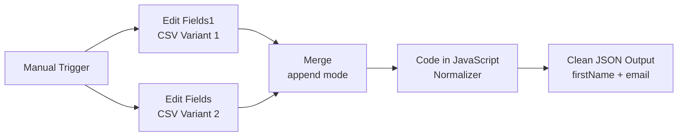

# Day 1 — CSV Normalizer Workflow

## Overview
An n8n automation workflow that ingests CSV data with inconsistent/random column headers
and normalizes them into a strict, clean schema (`firstName`, `email`).

Built as part of the **Trilles AI Automation Engineering Bootcamp — Day 1**.

---

## Problem Statement
Clients send lead data via CSV files where column headers change randomly.
Examples of the same field arriving with different names:

| Intended Field | Possible Header Variations |
|----------------|---------------------------|
| `firstName`    | `First Name`, `F. Name`, `fname`, `Name`, `f.name` |
| `email`        | `Email`, `email address`, `E-Mail`, `mail` |

A hardcoded column mapper breaks the moment a client changes their export format.
This workflow solves that with a dynamic alias-based normalizer.

---

## Workflow Architecture



---

## Nodes Explained

### 1. Manual Trigger
- Fires the workflow on demand
- In production: replace with **Email Trigger** or **Webhook** node

### 2. Edit Fields1 & Edit Fields (Set Nodes)
- Simulate two different CSV payloads from two different clients
- Each has a field `rawCsv` containing raw CSV text with different headers
- Demonstrates the real-world problem of header inconsistency

### 3. Merge (Append Mode)
- Combines both CSV inputs into a single stream
- Mode: **Append** — preserves all items from both inputs
- Passes 2 items downstream to the Code node

### 4. Code in JavaScript (The Core Logic)
This is where the normalization happens. Key components:

**HEADER_MAP** — alias dictionary:
```js
const HEADER_MAP = {
  firstName: ['first name', 'firstname', 'f. name', 'f.name', 'fname', 'name'],
  email: ['email', 'email address', 'e-mail', 'emailaddress', 'mail']
};
```
To support a new header variation, add one string to the relevant array. No other changes needed.

**normalizeKey()** — detects which alias a raw header matches:
```js
function normalizeKey(rawHeader) {
  const cleaned = rawHeader.trim().toLowerCase();
  for (const [targetKey, aliases] of Object.entries(HEADER_MAP)) {
    if (aliases.includes(cleaned)) return targetKey;
  }
  return null;
}
```

**colMap** — maps column index → normalized key name, so column order doesn't matter.

**Guards & Sanitization:**
- Skips rows with no email (data quality filter)
- Handles both real newlines and escaped `\n` in split regex
- Trims whitespace from all values

---

## Output Schema
Every record output by this workflow conforms to:
```json
{
  "firstName": "string",
  "email": "string"
}
```
Unknown columns (e.g. Phone, Mobile) are intentionally dropped.

---

## Environment Variables
No external API keys required for this workflow.

| Variable | Description | Required |
|----------|-------------|----------|
| N/A | This workflow runs fully locally | — |

> For production deployment on self-hosted n8n, ensure your Docker container
> has `N8N_BASIC_AUTH_ACTIVE=true` set.

---

## How to Run

### Prerequisites
- n8n running locally (Docker or Desktop)
- Node.js available inside n8n runtime

### Steps
1. Clone this repository
2. Open n8n at `http://localhost:5678`
3. Go to **Workflows** → click **Import**
4. Upload `day1_csv_normalizer.json` from the `/day1` folder
5. Click **Execute Workflow**
6. Click the **Code in JavaScript** node to inspect output

---

## How to Extend

### Adding new header variations
Open the Code node and add to `HEADER_MAP`:
```js
const HEADER_MAP = {
  firstName: ['first name', 'f. name', 'your new variation here'],
  email: ['email', 'your new variation here'],
  // Add a new target field entirely:
  company: ['company', 'company name', 'org', 'organisation']
};
```

### Adding new output fields
1. Add the new field to `HEADER_MAP` with its aliases
2. The normalizer picks it up automatically — no other changes needed

---

## Error Handling
| Scenario | Behavior |
|----------|----------|
| Row has no email | Silently dropped — not pushed to output |
| Unknown column header | Mapped to `null`, ignored |
| Empty CSV input | `continue` guard skips the item |
| Literal `\n` vs real newline | Handled by regex: `/\r?\n\|\\n/` |

---

## Potential Bottlenecks
| Area | Risk | Mitigation |
|------|------|------------|
| Large CSVs (10,000+ rows) | Single Code node processes all rows in memory | Split into batches using n8n's Split In Batches node |
| Comma inside a field value | `split(',')` breaks on `"Smith, Jr."` | Use a proper CSV parser library for production |
| New header not in alias map | Field silently dropped | Log unknown headers and alert via Slack/Discord |

---

## Rubric Self-Assessment
| Criteria | Level Achieved | Evidence |
|----------|---------------|----------|
| Error Handling | Competent | Missing email guard, empty line skip |
| Data Logic | Architect | Dynamic alias map + regex + column-index mapping |
| Efficiency | Competent | Single pass through rows, minimal node count |
| Documentation | Architect | This README + Mermaid diagram |
| Tooling | Competent | Manual Trigger + Set + Merge + Code node |
