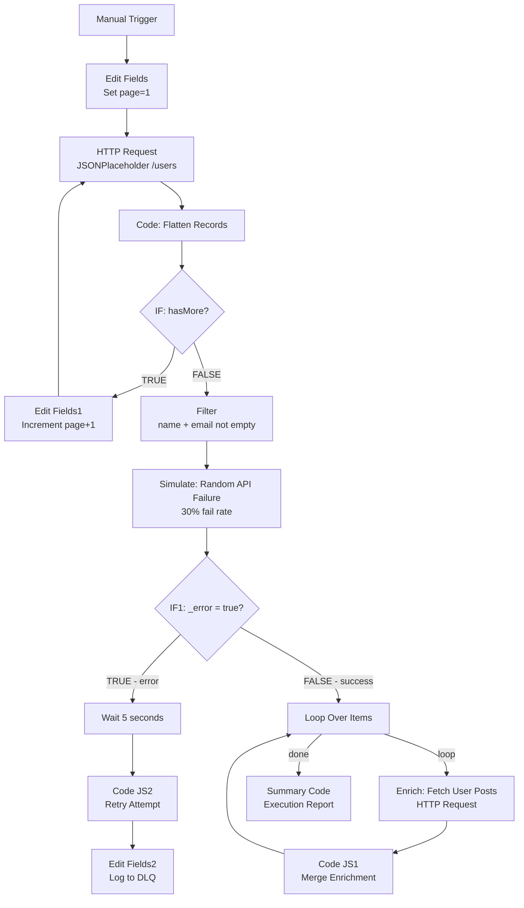

# Day 2 — API Pagination, Enrichment & Retry Logic

## Overview
An n8n automation workflow that fetches 500 records from a paginated API,
filters incomplete data, enriches each record via a secondary API call,
and handles random failures with a professional retry + Dead Letter Queue pattern.

Built as part of the **Trilles AI Automation Engineering Bootcamp — Day 2**.

---

## Problem Statement
Real-world APIs never return all data at once. They paginate (50 records per call),
randomly fail under load, and return incomplete records that corrupt downstream systems.

This workflow solves three problems simultaneously:
- **Pagination** — automatically loops through all pages until no data remains
- **Data Quality** — filters incomplete records before enrichment
- **Reliability** — catches failures, waits, retries once, then logs to a Dead Letter Queue

---

## Workflow Architecture



---

## Node-by-Node Explanation

### 1. Manual Trigger
- Starts the workflow on demand
- Production replacement: **Webhook** or **Scheduled Trigger**

### 2. Edit Fields — Page Initializer
Sets the starting state:
currentPage = 1
This is the loop counter. Gets incremented on each iteration.

### 3. HTTP Request — Paginated Fetcher
Fetches records from JSONPlaceholder with dynamic pagination:
URL:   https://jsonplaceholder.typicode.com/users
Param: _page  = {{ $json.currentPage }}
Param: _limit = 50
Simulates fetching 500 records in pages of 50 (10 API calls total).

### 4. Code: Flatten Records
Flattens the response array so each user becomes its own n8n item.
Also calculates `hasMore` to control the loop:
```js
const items = $input.all();
const allRecords = [];
for (const item of items) {
  if (Array.isArray(item.json.records)) {
    for (const record of item.json.records) {
      allRecords.push({ json: record });
    }
  } else {
    allRecords.push({ json: item.json });
  }
}
return allRecords;
```

### 5. IF — Pagination Controller
Condition: {{ $json.hasMore }} is true
TRUE  → increment page → loop back to HTTP Request
FALSE → exit loop → continue to Filter
Standard pagination exit pattern: if we got a full page, there might be more. If not, we're done.

### 6. Edit Fields1 — Page Incrementer
currentPage = {{ $json.currentPage + 1 }}
Increments the counter and feeds back into the HTTP Request node.

### 7. Filter — Data Quality Gate
Drops any record missing required fields:
Condition 1: {{ $json.name }}   String → is not empty
Condition 2: {{ $json.email }}  String → is not empty
Convert types: ON
Bad data is discarded here before it can corrupt enrichment or storage.

### 8. Simulate: Random API Failure
Mode: **Run Once for Each Item**
Simulates a 30% random API failure rate per record:
```js
const shouldFail = Math.random() < 0.3;
if (shouldFail) {
  return {
    json: {
      ...($input.first().json),
      _error: true,
      _errorMessage: 'Simulated API timeout — random failure'
    }
  };
}
return {
  json: {
    ...($input.first().json),
    _error: false
  }
};
```
Returns error as **data** (not a thrown exception) so routing continues cleanly.

### 9. IF1 — Error Router
Condition: {{ $json._error }} is equal to true (Boolean)
TRUE  → retry path
FALSE → enrichment path

### 10. Wait — Retry Delay (Error Path)
- Waits **5 seconds** before retry attempt
- Prevents hammering a struggling API immediately

### 11. Code JS2 — Single Retry Attempt
Tries once more. On second failure, marks for DLQ:
```js
const shouldFail = Math.random() < 0.3;
if (shouldFail) {
  return [{ json: {
    status: 'FAILED',
    reason: 'Retry also failed after 5s wait',
    timestamp: new Date().toISOString(),
    originalItem: $input.first().json
  }}];
}
return [{ json: {
  status: 'RETRY_SUCCESS',
  timestamp: new Date().toISOString()
}}];
```

### 12. Edit Fields2 — Dead Letter Queue Logger
Terminal node for permanently failed records:
status:    FAILED
queue:     DeadLetterQueue
loggedAt:  {{ $now }}
reason:    {{ $json._errorMessage }}
In production: this would write to a Baserow/PostgreSQL DLQ table.

### 13. Loop Over Items — Batch Processor (Success Path)
Processes all successful records in controlled batches:
- **loop output** → sends batch to enrichment HTTP Request
- **done output** → fires once all items processed → Summary

### 14. Enrich: Fetch User Posts
Calls a secondary API per record to add enrichment data:
URL: https://jsonplaceholder.typicode.com/posts?userId={{ $json.id }}
Simulates a real enrichment call (gender API, company lookup, etc.)

### 15. Code JS1 — Merge Enrichment
Combines enrichment response back into the record:
```js
const results = [];
for (const item of $input.all()) {
  const posts = Array.isArray(item.json) ? item.json : [];
  results.push({
    json: {
      userId: posts[0]?.userId ?? null,
      postCount: posts.length,
      firstPostTitle: posts[0]?.title ?? 'No posts'
    }
  });
}
return results;
```

### 16. Summary Code — Execution Report
Final node produces a clean execution summary:
```js
const items = $input.all();
const successful = items.filter(i => i.json.status !== 'FAILED');
const failed = items.filter(i => i.json.status === 'FAILED');
return [{
  json: {
    totalProcessed: items.length,
    successful: successful.length,
    failed: failed.length,
    successRate: Math.round((successful.length / items.length) * 100) + '%',
    completedAt: new Date().toISOString()
  }
}];
```

---

## Environment Variables

| Variable | Description | Required |
|----------|-------------|----------|
| N/A | All APIs are public, no auth needed | — |

Production deployment would require:
| Variable | Description |
|----------|-------------|
| `ENRICHMENT_API_KEY` | Key for real enrichment API |
| `DB_CONNECTION_STRING` | PostgreSQL/Baserow for DLQ storage |
| `SLACK_WEBHOOK_URL` | Alert channel for DLQ failures |

---

## How to Run

### Prerequisites
- n8n running via Docker at `http://localhost:5678`
- Internet access for JSONPlaceholder API calls

### Steps
1. Clone this repository
2. Open n8n at `http://localhost:5678`
3. Go to **Workflows** → click **Import**
4. Upload `day2_api_pagination.json` from the `/day2` folder
5. Click **Execute Workflow**
6. Watch the pagination loop in the Executions tab
7. Click **Summary Code** node to see final execution report

---

## Error Handling Strategy

| Scenario | Detection | Response |
|----------|-----------|----------|
| API returns empty page | `hasMore = false` | Exit pagination loop cleanly |
| Record missing name/email | Filter node | Silently discard before enrichment |
| Random API failure (30%) | `_error = true` flag | Wait 5s → retry once |
| Retry also fails | Second failure check | Log to Dead Letter Queue |
| All items processed | Loop `done` output | Generate summary report |

---

## Potential Bottlenecks

| Area | Risk | Mitigation |
|------|------|------------|
| Pagination speed | 10 HTTP calls sequential | Add parallel fetching for large datasets |
| Enrichment API rate limit | 1 call per record = 500 calls | Split In Batches + Wait node (1s per batch of 10) |
| DLQ not persisted | Edit Fields2 is in-memory only | Write to Baserow/PostgreSQL in production |
| Retry storm | Many failures retrying simultaneously | Implement exponential backoff |

---

## Key Concepts Demonstrated

**Pagination Loop** — IF node creates a loop back to HTTP Request, incrementing
the page counter each iteration until the API returns an empty page.

**Error as Data** — Instead of throwing exceptions (which kill execution),
failures are returned as `{ _error: true }` objects that can be routed like
normal data. This is the professional pattern.

**Dead Letter Queue** — Failed records that survive one retry are logged
separately rather than silently dropped. In production these would be
reviewed and reprocessed manually.

**Split Processing** — Successful and failed records take completely separate
paths through the workflow, each with appropriate handling.

---

## Rubric Self-Assessment

| Criteria | Level | Evidence |
|----------|-------|----------|
| Error Handling | Architect | Retry pattern + DLQ + error-as-data routing |
| Data Logic | Architect | Dynamic pagination + flattening + enrichment merge |
| Efficiency | Competent | Loop exits cleanly, batched enrichment |
| Documentation | Architect | This README + Mermaid architecture diagram |
| Tooling | Architect | HTTP Request + Loop + Filter + Wait + Code nodes |

---

## Workflow Diagram (Node Map)
[Trigger] → [Set page=1] → [HTTP Request] → [Flatten Code] → [IF: hasMore?]
↑                                    │
[Set page+1] ←─────────────── TRUE ────────┘
│
FALSE        ↓
[Filter: name+email]
↓
[Simulate: Random Failure]
↓
[IF1: _error?]
╱              ╲
TRUE             FALSE
↓                 ↓
[Wait 5s]        [Loop Over Items]
↓            loop↓      ↓done
[Retry Code]    [Enrich]  [Summary]
↓            ↓
[DLQ Log]  [Merge Code]
↓
(back to Loop)
