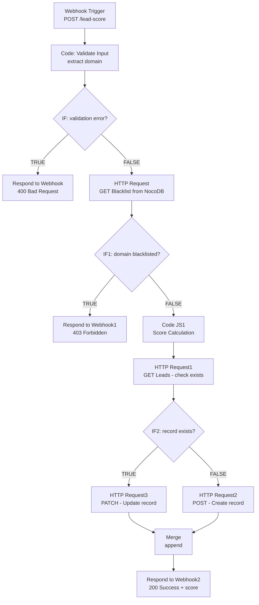

# Day 3 — Lead Scoring Engine (Webhook API + NocoDB)

## Overview
A production-grade REST API endpoint built entirely with n8n and NocoDB.
Accepts lead data via HTTP POST, validates input, checks against a blacklist,
calculates a quality score, and upserts the record into a database.

Built as part of the **Trilles AI Automation Engineering Bootcamp — Day 3**.

---

## Problem Statement
Sales teams waste time manually qualifying leads. This engine automates
three critical decisions:

- **Is this domain safe?** — Reject blacklisted domains with HTTP 403
- **How valuable is this lead?** — Score based on email type and company size
- **Is this a new lead or returning?** — Upsert prevents duplicate records

The result: a curl-able API that any CRM or web form can POST to.

---

## Workflow Architecture



---

## API Reference

### Endpoint
POST http://localhost:5678/webhook/lead-score
Content-Type: application/json

### Request Body
```json
{
  "email": "john@acme.com",
  "linkedinUrl": "https://linkedin.com/in/john",
  "companySize": 500
}
```

### Response — Success (200)
```json
{
  "success": true,
  "email": "john@acme.com",
  "score": 65,
  "emailType": "corporate",
  "tier": "WARM"
}
```

### Response — Blacklisted Domain (403)
```json
{
  "error": "Domain blacklisted",
  "domain": "spam.com"
}
```

### Response — Missing Fields (400)
```json
{
  "error": true,
  "statusCode": 400,
  "message": "email is required"
}
```

---

## Scoring Logic

| Condition | Points |
|-----------|--------|
| Generic email (gmail, yahoo, hotmail...) | +10 |
| Corporate email (custom domain) | +50 |
| Company size > 1000 employees | +30 |
| Company size 101–1000 employees | +15 |
| Company size 11–100 employees | +5 |

### Score Tiers
| Score Range | Tier |
|-------------|------|
| 70+ | 🔥 HOT |
| 40–69 | ♨️ WARM |
| 0–39 | ❄️ COLD |

---

## Node-by-Node Explanation

### 1. Webhook Trigger
- Method: POST
- Path: `/lead-score`
- Response Mode: Last Node (returns final output as HTTP response)
- Production: Add authentication header validation here

### 2. Code: Validate Input
Extracts and validates the incoming payload:
```js
const body = $input.first().json.body;
if (!body.email) return [{ json: { error: true, statusCode: 400, message: 'email is required' }}];
const emailDomain = body.email.split('@')[1]?.toLowerCase();
return [{ json: { email: body.email, emailDomain, companySize: body.companySize || 0 }}];
```
Also extracts `emailDomain` for blacklist checking downstream.

### 3. IF — Validation Gate
{{ $json.error }} is equal to true
TRUE  → 400 response
FALSE → continue to blacklist check

### 4. HTTP Request — Blacklist Query (GET)
Queries NocoDB Blacklist table for the email domain:
GET /api/v1/db/data/noco/{projectId}/Blacklist
Query: where=(domain,eq,{{ $json.emailDomain }})
Auth: xc-auth header (stored as n8n Credential)

### 5. IF1 — Blacklist Gate
{{ $json.pageInfo.totalRows }} greater than 0
TRUE  → 403 Forbidden response
FALSE → continue to scoring

### 6. Code JS1 — Score Calculator
Determines email type and calculates final score:
```js
const genericDomains = ['gmail.com','yahoo.com','hotmail.com','outlook.com'...];
const isGeneric = genericDomains.includes(emailDomain);
let score = isGeneric ? 10 : 50;
let emailType = isGeneric ? 'generic' : 'corporate';
if (companySize > 1000) score += 30;
else if (companySize > 100) score += 15;
else if (companySize > 10) score += 5;
const tier = score >= 70 ? 'HOT' : score >= 40 ? 'WARM' : 'COLD';
```

### 7. HTTP Request1 — Existence Check (GET)
Before writing, checks if lead already exists:
GET /api/v1/db/data/noco/{projectId}/Leads
Query: where=(email,eq,{{ $json.email }})

### 8. IF2 — Upsert Decision
{{ $json.pageInfo.totalRows }} greater than 0
TRUE  → PATCH existing record (update)
FALSE → POST new record (create)

### 9. HTTP Request3 — Update Existing (PATCH)
PATCH /api/v1/db/data/noco/{projectId}/Leads/{{ $json.list[0].Id }}
Body: { score, emailType, tier, updatedAt }

### 10. HTTP Request2 — Create New (POST)
POST /api/v1/db/data/noco/{projectId}/Leads
Body: { email, emailType, companySize, score, tier, createdAt }

### 11. Merge (Append)
Combines both CREATE and UPDATE paths into a single stream
for the final response node.

### 12. Respond to Webhook2
Returns 200 with the scored lead data back to the caller.

---

## Database Schema (NocoDB)

### Blacklist Table
| Column | Type | Description |
|--------|------|-------------|
| domain | Single line text | e.g. spam.com |
| reason | Single line text | Why it's blacklisted |
| addedAt | Date | When it was added |

### Leads Table
| Column | Type | Description |
|--------|------|-------------|
| email | Email | Primary identifier |
| emailType | Single line text | generic / corporate |
| companySize | Number | From request payload |
| score | Number | Calculated score |
| tier | Single line text | HOT / WARM / COLD |
| createdAt | Date | First submission |
| updatedAt | Date | Last update |

---

## Environment Variables

| Variable | Description | Required |
|----------|-------------|----------|
| `NOCODB_API_TOKEN` | NocoDB xc-auth token | Yes |
| `NOCODB_PROJECT_ID` | Your NocoDB project ID | Yes |
| `NOCODB_BASE_URL` | e.g. http://localhost:8080 | Yes |

> All stored as n8n Credentials (Header Auth type) — never hardcoded in nodes.

---

## How to Run

### Prerequisites
- n8n running at `http://localhost:5678`
- NocoDB running at `http://localhost:8080`
- Both accessible (Docker network or localhost)

### Setup Steps
1. Import `day3_lead_scoring_engine.json` into n8n
2. Create NocoDB base `LeadEngine` with Blacklist + Leads tables
3. Add NocoDB token as n8n Header Auth Credential
4. Update all HTTP Request nodes with your projectId
5. Toggle workflow to **Active** (required for webhook to work)

### Test Commands
```bash
# Test valid corporate lead
curl -X POST http://localhost:5678/webhook/lead-score \
  -H "Content-Type: application/json" \
  -d '{"email":"john@acme.com","linkedinUrl":"https://linkedin.com/in/john","companySize":500}'

# Test blacklisted domain
curl -X POST http://localhost:5678/webhook/lead-score \
  -H "Content-Type: application/json" \
  -d '{"email":"test@spam.com","linkedinUrl":"https://linkedin.com/in/test","companySize":10}'

# Test missing email (should return 400)
curl -X POST http://localhost:5678/webhook/lead-score \
  -H "Content-Type: application/json" \
  -d '{"linkedinUrl":"https://linkedin.com/in/test","companySize":10}'

# Test upsert (run same email twice — second should PATCH not POST)
curl -X POST http://localhost:5678/webhook/lead-score \
  -H "Content-Type: application/json" \
  -d '{"email":"john@acme.com","linkedinUrl":"https://linkedin.com/in/john","companySize":500}'
```

---

## Error Handling

| Scenario | HTTP Code | Response |
|----------|-----------|----------|
| Missing email field | 400 | `{ error: true, message: "email is required" }` |
| Missing linkedinUrl | 400 | `{ error: true, message: "linkedinUrl is required" }` |
| Blacklisted domain | 403 | `{ error: "Domain blacklisted", domain: "..." }` |
| Valid new lead | 200 | Full scored record |
| Valid returning lead | 200 | Updated score record |

---

## Potential Bottlenecks

| Area | Risk | Mitigation |
|------|------|------------|
| NocoDB query speed | Slow on large Blacklist table | Add index on `domain` column |
| No rate limiting on webhook | Abuse / spam submissions | Add IP rate limiting via reverse proxy |
| Upsert race condition | Two identical emails submitted simultaneously | Add database-level unique constraint on email |
| Score not versioned | Can't track score history | Add ScoreHistory table with timestamps |

---

## Rubric Self-Assessment

| Criteria | Level | Evidence |
|----------|-------|----------|
| Error Handling | Architect | 400 validation + 403 blacklist + upsert logic |
| Data Logic | Architect | Domain extraction + scoring algorithm + tier system |
| Efficiency | Competent | Existence check before write prevents duplicates |
| Documentation | Architect | Full API docs + schema + test commands |
| Tooling | Architect | Webhook + NocoDB HTTP API + Credentials + Merge |
