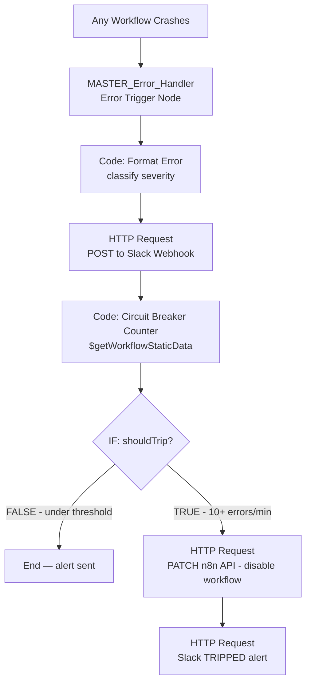

# Day 4 — Production Standards: Error Handling & Security

## Overview
A production-grade error handling system built with n8n and Slack.
Implements a Master Error Workflow that catches failures from ANY workflow
and sends structured Slack alerts, plus a Circuit Breaker that automatically
disables workflows when error rate exceeds threshold.

Built as part of the **Trilles AI Automation Engineering Bootcamp — Day 4**.

---

## Problem Statement
Silent workflow failures are the most dangerous production issue.
A sync can fail at 2 AM and no one knows until the client calls.

This system solves three problems:
- **Visibility** — every failure sends an immediate Slack alert with full context
- **Diagnosis** — alerts include which node failed, error message, and a direct debug URL
- **Protection** — Circuit Breaker auto-disables a workflow after 10 errors in 1 minute

---

## Workflow Architecture



---

## System Components

### Component 1 — MASTER_Error_Handler Workflow

A dedicated always-active workflow. Every other workflow points to it
via Settings → Error Workflow. When any workflow crashes, n8n automatically
fires this handler and passes full error context.

**Error data received:**
execution.id    → which run failed
execution.url   → direct link to the failed execution in n8n UI
node.name       → which specific node caused the crash
node.type       → what kind of node it was
error.message   → the actual error text
workflow.id     → which workflow failed
workflow.name   → human-readable workflow name

### Component 2 — Circuit Breaker

Uses `$getWorkflowStaticData('global')` — n8n's built-in persistent
key-value store that survives between executions without a database.

Maintains a sliding 1-minute error window per workflow ID.
When count hits 10, calls the n8n REST API to deactivate the workflow.

---

## Node-by-Node Explanation

### 1. Error Trigger
- Starting node of MASTER_Error_Handler
- No configuration needed — receives error data automatically
- Must be Active at all times
- Replacement for Manual Trigger in this workflow type

### 2. Code: Format Error + Classify Severity
Extracts all error fields and classifies severity:
```js
const e = $input.first().json;

const workflowName = e.workflow?.name    || 'Unknown Workflow';
const workflowId   = e.workflow?.id      || 'N/A';
const nodeName     = e.node?.name        || 'Unknown Node';
const nodeType     = e.node?.type        || 'Unknown Type';
const errorMsg     = e.error?.message    || 'No message';
const executionUrl = e.execution?.url    || 'N/A';
const timestamp    = new Date().toISOString();

let severity = 'LOW'; let slackColor = 'warning';
if (errorMsg.includes('timeout') || errorMsg.includes('ECONNREFUSED')) {
  severity = 'MEDIUM'; slackColor = 'warning';
}
if (errorMsg.includes('401') || errorMsg.includes('403')) {
  severity = 'HIGH'; slackColor = 'danger';
}
if (nodeName.toLowerCase().includes('nocodb')) {
  severity = 'CRITICAL'; slackColor = 'danger';
}
```

**Severity levels:**
| Level | Trigger | Slack Color |
|-------|---------|-------------|
| LOW | Default | Yellow (warning) |
| MEDIUM | Timeout / connection refused | Yellow (warning) |
| HIGH | 401 / 403 auth errors | Red (danger) |
| CRITICAL | NocoDB / CRM node failure | Red (danger) |

### 3. HTTP Request — Slack Alert
Posts a rich attachment card to #error-alerts channel:
```json
{
  "username": "n8n Error Bot",
  "channel": "#error-alerts",
  "attachments": [{
    "color": "{{ $json.slackColor }}",
    "title": "Workflow Failure — {{ $json.severity }}",
    "fields": [
      {"title":"Workflow","value":"{{ $json.workflowName }}","short":true},
      {"title":"Failed Node","value":"{{ $json.nodeName }}","short":true},
      {"title":"Error","value":"{{ $json.errorMsg }}","short":false},
      {"title":"Debug URL","value":"{{ $json.executionUrl }}","short":false}
    ]
  }]
}
```

### 4. Code: Circuit Breaker Counter
Uses static data to maintain a sliding error window:
```js
const staticData = $getWorkflowStaticData('global');
if (!staticData.errorLog) staticData.errorLog = {};
if (!staticData.errorLog[workflowId]) staticData.errorLog[workflowId] = [];

const now = Date.now();
const ONE_MIN = 60 * 1000;

staticData.errorLog[workflowId].push(now);
staticData.errorLog[workflowId] = staticData.errorLog[workflowId]
  .filter(t => now - t < ONE_MIN);

const errorCount = staticData.errorLog[workflowId].length;
const shouldTrip = errorCount >= 10;
```

### 5. IF — Circuit Trip Decision
{{ $json.shouldTrip }} is equal to true (Boolean)
TRUE  → disable workflow + send tripped alert to Slack
FALSE → execution ends, alert already sent

### 6. HTTP Request — Disable Workflow (TRUE branch)
Calls n8n's own REST API to deactivate the failing workflow:
Method: PATCH
URL:    http://localhost:5678/api/v1/workflows/{{ $json.workflowId }}
Header: X-N8N-API-KEY: stored as n8n Credential
Body:   { "active": false }

### 7. HTTP Request — Slack TRIPPED Alert
Sends a second Slack message announcing the circuit breaker fired:
```json
{
  "attachments": [{
    "color": "danger",
    "title": "CIRCUIT BREAKER TRIPPED",
    "text": "Workflow has been AUTOMATICALLY DISABLED after 10 errors in 1 minute.",
    "fields": [
      {"title":"Action Taken","value":"Workflow deactivated via n8n API"},
      {"title":"Next Step","value":"Manual review required before re-enabling"}
    ]
  }]
}
```

---

## Slack Setup

### Workspace
- Platform: Slack (browser version — no install required)
- Workspace name: Trilles-Automation-Alerts
- Alert channel: #error-alerts (private)

### Webhook Configuration
1. Go to `https://api.slack.com/apps`
2. Create New App → From scratch → name: `n8n-error-bot`
3. Enable Incoming Webhooks
4. Add webhook to #error-alerts channel
5. Copy webhook URL → paste into n8n HTTP Request node URL field

---

## Environment Variables

| Variable | Description | Required |
|----------|-------------|----------|
| `SLACK_WEBHOOK_URL` | Incoming webhook URL from api.slack.com | Yes |
| `N8N_API_KEY` | n8n REST API key for Circuit Breaker | Yes |

> Both stored as n8n Header Auth Credentials — never hardcoded in nodes.

---

## How to Run

### Prerequisites
- n8n running at `http://localhost:5678`
- Slack workspace created at `https://app.slack.com`
- Incoming webhook URL obtained from `https://api.slack.com/apps`

### Setup Steps
1. Import `day4_master_error_handler.json` into n8n
2. Set workflow to **Active** immediately
3. Open Day 1, Day 2, Day 3 workflows → Settings → Error Workflow → select MASTER_Error_Handler
4. Add your Slack webhook URL to the HTTP Request node
5. Add your n8n API key as a Header Auth credential

### Test the System
```js
// Add this to any Code node in Day 1 workflow temporarily
throw new Error('TEST — intentional failure for error handler demo');
```
Trigger Day 1 → check #error-alerts in Slack → red card should appear.
Remove the throw line after confirming.

---

## Error Handling Logic

| Scenario | Detection | Response |
|----------|-----------|----------|
| Any node throws an error | Error Trigger fires | Slack alert sent immediately |
| Auth failure (401/403) | Severity classifier | HIGH severity red alert |
| Database node failure | Node name check | CRITICAL severity red alert |
| 10+ errors in 1 minute | Circuit Breaker Counter | Workflow auto-disabled + TRIPPED alert |
| Under threshold | shouldTrip = false | Alert sent, execution ends normally |

---

## Circuit Breaker States
CLOSED (normal):   errors < 10/min  → workflow runs normally
OPEN   (tripped):  errors >= 10/min → workflow auto-disabled
RESET:             manual re-enable required after review

---

## Potential Bottlenecks

| Area | Risk | Mitigation |
|------|------|------------|
| Static data resets | n8n restart clears error counters | Use NocoDB for persistent error counts in production |
| Slack rate limiting | Too many alerts flood the channel | Add deduplication — same error within 60s sends only once |
| Circuit Breaker too sensitive | Legitimate traffic spike trips it | Make threshold configurable via environment variable |
| No recovery workflow | Manual re-enable required every time | Add a scheduled "health check" workflow that re-enables after 30 min |

---

## Workflows Connected to Error Handler

| Workflow | Day | Connected |
|----------|-----|-----------|
| Day1_CSV_Analyzer | Day 1 | Yes |
| Day2_API_Pagination | Day 2 | Yes |
| Day3_Lead_Scoring_Engine | Day 3 | Yes |
| MASTER_Error_Handler | Day 4 | N/A (is the handler) |

---

## Rubric Self-Assessment

| Criteria | Level | Evidence |
|----------|-------|----------|
| Error Handling | Architect | Global error handler + severity classification + Circuit Breaker |
| Data Logic | Architect | Static data sliding window + n8n API integration |
| Efficiency | Competent | Single handler covers all workflows, minimal node count |
| Documentation | Architect | Full README + architecture diagram + test instructions |
| Tooling | Architect | Error Trigger + Static Data + n8n REST API + Slack Webhook |
