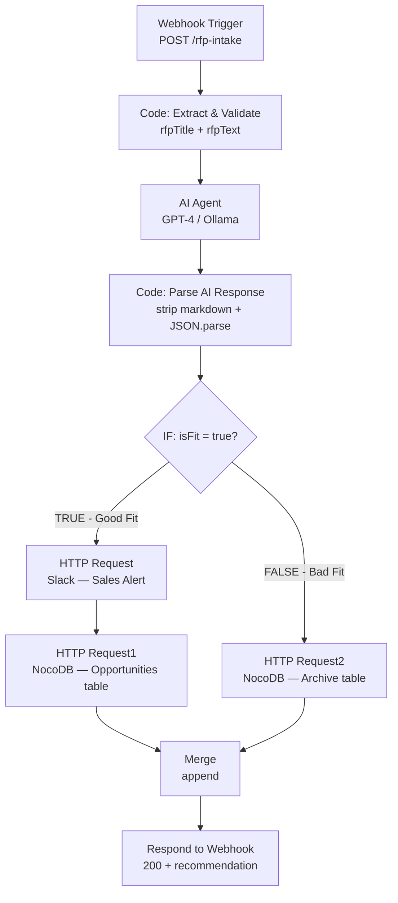

# Day 5 — Capstone: Autonomous RFP Analyzer

## Overview
An end-to-end AI-powered pipeline that automatically analyzes Request for Proposal
(RFP) documents, scores them against Trilles AI's core competencies, makes a
bid/no-bid recommendation, stores the result in NocoDB, and alerts the sales team
via Slack — all without human intervention.

Built as part of the **Trilles AI Automation Engineering Bootcamp — Day 5 Capstone**.

---

## Problem Statement
Trilles AI receives RFPs regularly. Before this pipeline, someone had to manually
read every document and decide whether to bid. This took 30 minutes per RFP.

At 10 RFPs per week, that's **5 hours of manual review saved every week.**

This pipeline solves three problems:
- **Speed** — decision in seconds, not 30 minutes
- **Consistency** — same scoring criteria applied every time, no human bias
- **Visibility** — every decision logged in NocoDB with AI reasoning attached

---

## Workflow Architecture



---

## API Reference

### Endpoint
POST http://localhost:5678/webhook/rfp-intake
Content-Type: application/json

### Request Body
```json
{
  "rfpTitle": "Automation Platform for Sales Pipeline",
  "rfpText":  "Full RFP document text here...",
  "source":   "email"
}
```

### Response — Good Fit (200)
```json
{
  "processed":      true,
  "rfpTitle":       "Automation Platform for Sales Pipeline",
  "recommendation": "BID",
  "fitScore":       85,
  "isFit":          true
}
```

### Response — Bad Fit (200)
```json
{
  "processed":      true,
  "rfpTitle":       "iOS Mobile App Development",
  "recommendation": "NO_BID",
  "fitScore":       10,
  "isFit":          false
}
```

---

## AI Scoring System

### Core Competency Match (Positive Scores)
| Technology | Points |
|------------|--------|
| n8n mentioned | +40 |
| Python mentioned | +30 |
| REST APIs / Webhooks | +20 |
| PostgreSQL / Databases | +10 |

### Outside Competency (Negative Scores)
| Technology | Points |
|------------|--------|
| Mobile (iOS/Android/Swift/React Native) | -50 |
| Blockchain / Web3 | -40 |
| Hardware / IoT | -30 |

### Decision Threshold
fitScore >= 50 → isFit = true  → recommendation = BID
fitScore < 50  → isFit = false → recommendation = NO_BID

---

## Node-by-Node Explanation

### 1. Webhook Trigger
- Method: POST
- Path: `/rfp-intake`
- Response Mode: Last Node (returns final decision as HTTP response)
- Production replacement: Google Drive trigger monitoring a folder for new PDFs

### 2. Code: Extract & Validate
Validates required fields and structures the payload:
```js
const body = $input.first().json.body;
if (!body.rfpText) return [{json:{ error: true, message: 'rfpText required' }}];
return [{json:{
  rfpTitle:   body.rfpTitle || 'Untitled RFP',
  rfpText:    body.rfpText,
  receivedAt: new Date().toISOString(),
  source:     body.source || 'webhook',
  error:      false
}}];
```

### 3. AI Agent
Uses GPT-4 (or Ollama for self-hosted) with a structured output system prompt.
Forced JSON-only response ensures the downstream parse node works reliably.

System prompt forces this exact output schema:
```json
{
  "rfpTitle":       "string",
  "budget":         "number or null",
  "deadline":       "YYYY-MM-DD or null",
  "techStack":      "comma-separated string",
  "isFit":          "boolean",
  "fitScore":       "0-100 integer",
  "fitReason":      "one sentence string",
  "recommendation": "BID or NO_BID"
}
```

### 4. Code: Parse AI Response
Strips markdown fences (LLMs sometimes add them despite instructions) and
parses the JSON safely:
```js
const aiResponse = $input.first().json.output || '';
const cleaned = aiResponse.replace(/```json/g,'').replace(/```/g,'').trim();
try {
  const parsed = JSON.parse(cleaned);
  return [{json:{ ...parsed, parsedAt: new Date().toISOString() }}];
} catch(e) {
  return [{json:{ error: true, message: 'AI returned invalid JSON' }}];
}
```

### 5. IF — Bid Decision Router
{{ $json.isFit }} is equal to true (Boolean)
TRUE  → Good Fit path (Slack + Opportunities)
FALSE → Bad Fit path (Archive only)

### 6. HTTP Request — Slack Sales Alert (Good Fit only)
Posts a green attachment card to #error-alerts channel:
```json
{
  "attachments": [{
    "color": "good",
    "title": "New RFP — Good Fit Detected",
    "fields": [
      {"title":"RFP","value":"{{ $('If').first().json.rfpTitle }}"},
      {"title":"Fit Score","value":"{{ $('If').first().json.fitScore }}/100"},
      {"title":"Budget","value":"{{ $('If').first().json.budget }}"},
      {"title":"Tech Stack","value":"{{ $('If').first().json.techStack }}"},
      {"title":"Reason","value":"{{ $('If').first().json.fitReason }}"}
    ]
  }]
}
```

> Note: Uses `$('If').first().json` not `$json` — because `$json` at this point
> contains the Slack response `{data: "ok"}`, not the RFP data.

### 7. HTTP Request1 — Save to NocoDB Opportunities (Good Fit)
POST /api/v1/db/data/noco/{projectId}/Opportunities
Body references $('If').first().json to bypass Slack response in $json

### 8. HTTP Request2 — Save to NocoDB Archive (Bad Fit)
POST /api/v1/db/data/noco/{projectId}/Archive
Fields: rfpTitle, rejectionReason, techStack, budget, analyzedAt

### 9. Merge (Append)
Combines both Good Fit and Bad Fit paths into a single stream
for the final Respond to Webhook node.

### 10. Respond to Webhook
Returns the decision as an HTTP response to the original curl/caller.

---

## Database Schema (NocoDB)

### Opportunities Table (Good Fit RFPs)
| Column | Type | Description |
|--------|------|-------------|
| rfpTitle | Single line text | Name of the RFP |
| budget | Currency | Extracted budget figure |
| deadline | Date | Project deadline |
| techStack | Long text | Technologies mentioned |
| fitReason | Long text | AI reasoning for fit |
| slackAlerted | Checkbox | Whether sales was notified |
| approvedBy | Single line text | Manager name (HITL bonus) |
| createdAt | Date and time | When record was created |

### Archive Table (Bad Fit RFPs)
| Column | Type | Description |
|--------|------|-------------|
| rfpTitle | Single line text | Name of the RFP |
| rejectionReason | Long text | AI reasoning for rejection |
| techStack | Long text | Technologies mentioned |
| budget | Currency | Budget for reference |
| analyzedAt | Date and time | When it was analyzed |

---

## Environment Variables

| Variable | Description | Required |
|----------|-------------|----------|
| `OPENAI_API_KEY` | OpenAI API key for AI Agent | Yes (or use Ollama) |
| `NOCODB_API_TOKEN` | NocoDB xc-auth token | Yes |
| `NOCODB_PROJECT_ID` | NocoDB project ID | Yes |
| `SLACK_WEBHOOK_URL` | Incoming webhook URL | Yes |

> All stored as n8n Credentials — never hardcoded in workflow nodes.

---

## How to Run

### Prerequisites
- n8n running at `http://localhost:5678`
- NocoDB running at `http://localhost:8080`
- Slack workspace with incoming webhook configured
- OpenAI API key OR Ollama running locally

### Setup Steps
1. Import `day5_rfp_analyzer_capstone.json` into n8n
2. Create Opportunities and Archive tables in NocoDB
3. Add OpenAI and NocoDB credentials in n8n
4. Update NocoDB HTTP Request nodes with your projectId
5. Toggle workflow to Active

### Test Commands

```bash
# Good Fit RFP — should go to Opportunities + Slack alert
curl -X POST http://localhost:5678/webhook/rfp-intake \
  -H "Content-Type: application/json" \
  -d '{
    "rfpTitle": "Automation Platform for Sales Pipeline",
    "rfpText": "We need workflow automation using n8n and Python scripts. Budget: $25,000. Deadline: March 2025. Tech stack: n8n, Python, REST APIs, PostgreSQL.",
    "source": "email"
  }'

# Bad Fit RFP — should go to Archive only
curl -X POST http://localhost:5678/webhook/rfp-intake \
  -H "Content-Type: application/json" \
  -d '{
    "rfpTitle": "iOS Mobile App Development",
    "rfpText": "We need a native iOS app in Swift with React Native fallback. Budget: $50,000. Deadline: June 2025. Tech stack: Swift, React Native, Firebase.",
    "source": "email"
  }'
```

---

## Key Technical Decisions

**Why Webhook instead of Google Drive trigger?**
Webhook is transport-agnostic — the same downstream AI logic works whether
the trigger is a Drive file, an email attachment, or a direct POST. For the
demo this makes testing faster and more controlled.

**Why `$('If').first().json` instead of `$json` in NocoDB nodes?**
After the Slack HTTP Request, `$json` contains Slack's response `{data:"ok"}`.
The RFP data lives in the IF node's output. Referencing by node name bypasses
intermediate responses and accesses the correct data directly.

**Why force JSON in the AI system prompt?**
LLMs are non-deterministic. Without forcing structured output, the response
format changes between runs — sometimes markdown, sometimes prose, sometimes
JSON. Forcing JSON-only output makes the pipeline deterministic and parseable.

**Why wrap JSON.parse in try/catch?**
Even with instructions, LLMs occasionally add preamble text. The cleaning step
strips markdown fences, and the try/catch prevents a bad AI response from
crashing the entire workflow silently.

---

## Bonus — Human in the Loop (High Distinction)

Instead of auto-saving Good Fit RFPs, a manager must click Approve in Slack
before the record saves to NocoDB. Implemented using Slack Block Kit interactive
buttons + a second n8n Webhook that receives the button click payload.
Good Fit detected
↓
Slack message with Approve / Reject buttons
↓
Manager clicks Approve
↓
Slack sends POST to /webhook/rfp-approve
↓
n8n saves to NocoDB Opportunities

Requires Slack app Interactivity enabled at api.slack.com/apps with the
request URL set to `http://localhost:5678/webhook/rfp-approve`.

---

## Error Handling

| Scenario | Detection | Response |
|----------|-----------|----------|
| Missing rfpText field | Validation Code node | Returns error object, stops processing |
| AI returns invalid JSON | try/catch in parse node | Returns error with raw AI output for debugging |
| NocoDB save fails | MASTER_Error_Handler (Day 4) | Slack alert fired automatically |
| Any node crashes | Error Workflow connected | Day 4 circuit breaker monitors this workflow too |

---

## Complete 5-Day Integration

This capstone connects every system built during the bootcamp:

| Day | System | Role in Capstone |
|-----|--------|-----------------|
| Day 1 | CSV Normalizer | Pattern: Code node data transformation |
| Day 2 | Pagination + Retry | Pattern: Reliable HTTP calls |
| Day 3 | NocoDB + Webhook | Direct: same NocoDB base, same webhook pattern |
| Day 4 | Master Error Handler | Direct: this workflow points to MASTER_Error_Handler |
| Day 5 | RFP Analyzer | The capstone bringing all patterns together |

---

## Business Impact

| Metric | Before | After |
|--------|--------|-------|
| Time per RFP review | 30 minutes | ~8 seconds |
| RFPs per week | 10 | 10 |
| Weekly time saved | — | ~5 hours |
| Consistency | Varies by reviewer | 100% consistent scoring |
| Audit trail | None | Full NocoDB log with AI reasoning |

---

## Rubric Self-Assessment

| Criteria | Level | Evidence |
|----------|-------|----------|
| Error Handling | Architect | Validation gate + JSON parse try/catch + Day 4 error handler connected |
| Data Logic | Architect | AI structured output + score algorithm + node-reference fix for $json context |
| Efficiency | Architect | Single AI call per RFP, clean two-path routing, merge before response |
| Documentation | Architect | Full API docs + schema + test commands + business impact table |
| Tooling | Architect | Webhook + AI Agent + NocoDB HTTP API + Slack + Merge + Error Handler |
