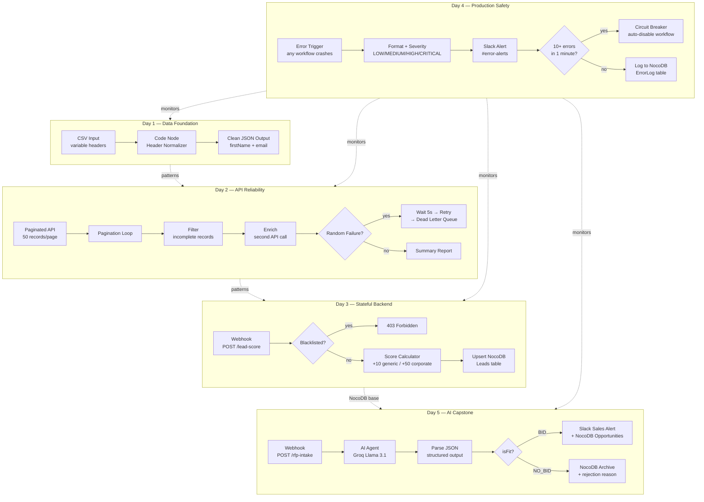

# Trilles AI — Automation Engineering Bootcamp
### 5-Day Intensive Onboarding | Complete Portfolio

**Engineer:** [Your Name]
**Lead Architect:** Muhammad Daniyal Aziz
**Duration:** 5 Days Intensive
**Stack:** n8n · NocoDB · Groq (Llama 3.1) · Slack · Docker

---

## Overview

This repository contains the complete deliverables for the Trilles AI Automation
Engineering Bootcamp — a 5-day intensive program designed to move engineers from
"drag and drop" thinking to production-grade automation architecture.

Each day builds on the previous. By Day 5, all systems are interconnected:
the CSV normalizer's patterns inform the AI pipeline, the API retry logic
from Day 2 protects every HTTP call, the NocoDB backend from Day 3 stores
all decisions, and the Day 4 error handler monitors everything — including
the Day 5 capstone.

---

## Repository Structure
Automation_Onboarding/
├── Day1/
│   ├── Day1_CSV_Analyzer.json
│   └── README.md
├── Day2/
│   ├── Day2_API_Pagination.json
│   └── README.md
├── Day3/
│   ├── Day3_Lead_Scoring_Engine.json
│   └── README.md
├── Day4/
│   ├── Day4_MASTER_Error_Handler.json
│   └── README.md
├── Day5/
│   ├── Day5_RFP_Analyzer_Capstone.json
│   └── README.md
├── .env.example
├── .gitignore
└── README.md          ← you are here

---

## The Trilles Standard

Every workflow in this repository follows three non-negotiable rules:

> **If it breaks silently, you failed.** — Error handling is mandatory.
> **If you can't explain it, you didn't build it.** — Loom videos are mandatory.
> **If it isn't documented, it doesn't exist.** — Schema maps are mandatory.

---

## System Architecture — All 5 Days



---

## Day-by-Day Summary

### Day 1 — The Automator's Mindset & JSON Architecture

**Problem:** Clients send CSV files with random, inconsistent column headers.
A hardcoded mapper breaks the moment a client changes their export format.

**Solution:** A dynamic alias-based normalizer using a Code node. The
`HEADER_MAP` dictionary lists every known variation of each field. Adding
support for a new header variation is a single line change.

**Key concepts demonstrated:**
- n8n data structure: items, json, binary
- Code node over Set node for complex logic
- Dynamic key mapping with JavaScript
- Email regex validation before data enters the pipeline

**Workflow:** `Manual Trigger → Set (mock CSV) × 2 → Merge → Code (normalize)`

**Output:** Clean `{ firstName, email }` objects regardless of input header format.

---

### Day 2 — API Integration, Pagination & Retry Logic

**Problem:** Real APIs paginate (50 records per call), randomly fail under
load, and return incomplete records that corrupt downstream systems.

**Solution:** A three-part pipeline — a pagination loop that runs until the
API returns an empty page, a filter that drops bad records before enrichment,
and a retry mechanism that catches failures, waits 5 seconds, retries once,
then logs permanent failures to a Dead Letter Queue.

**Key concepts demonstrated:**
- Pagination loop using IF node with page counter
- Error-as-data pattern: failures returned as `{ _error: true }` not thrown
- Single retry with 5-second Wait node
- Dead Letter Queue logging for unrecoverable failures
- Execution summary report at pipeline end

**Workflow:** `Trigger → Set page=1 → HTTP Request → Flatten → IF (hasMore?) → loop back / Filter → Simulate Failure → IF (error?) → Wait → Retry → DLQ / Loop Over Items → Enrich → Summary`

**Output:** 500 records fetched, filtered, enriched, with full failure audit trail.

---

### Day 3 — Open Source Stack: Databases & Logic

**Problem:** Automation teams need stateful backends — not just one-way
data pushes. Leads must be deduplicated, blacklisted domains rejected,
and scores calculated consistently.

**Solution:** A fully functional REST API endpoint built with n8n Webhooks
and NocoDB. POST a lead, get back a score. Duplicate submissions update
the existing record instead of creating a new one.

**Key concepts demonstrated:**
- Webhook as API endpoint with HTTP response codes
- Blacklist check returning HTTP 403 before processing
- Lead scoring algorithm: +10 generic email, +50 corporate email
- HOT / WARM / COLD tier classification
- Upsert pattern: GET to check existence → POST or PATCH accordingly
- NocoDB as open-source Airtable alternative

**Workflow:** `Webhook → Validate → IF (error?) → HTTP (blacklist check) → IF (blacklisted? 403) → Code (score) → HTTP (exists?) → IF → POST or PATCH → Merge → Respond`

**API:** `POST /webhook/lead-score → { score, tier, emailType }`

---

### Day 4 — Production Standards: Error Handling & Security

**Problem:** Silent failures. A critical workflow crashed at 2 AM and no
one knew until the client called the next morning.

**Solution:** A Master Error Workflow using n8n's Error Trigger node.
Every other workflow points to it. Any crash — anywhere, any time —
fires a structured Slack alert with the exact node name, error message,
severity classification, and a direct debug URL.

Additionally, a Circuit Breaker uses `$getWorkflowStaticData` to count
errors per workflow per minute. At 10 errors in 60 seconds, it calls
the n8n REST API to automatically deactivate the failing workflow,
preventing API bans and cascading failures.

**Key concepts demonstrated:**
- Error Trigger node as global catch handler
- Severity classification: LOW / MEDIUM / HIGH / CRITICAL
- Slack attachment cards with color-coded severity
- `$getWorkflowStaticData` for stateless persistent counters
- n8n REST API integration for self-modification
- Circuit Breaker pattern: closed → open → manual reset
- NocoDB ErrorLog as permanent Dead Letter Queue audit trail

**Workflow:** `Error Trigger → Code (format + severity) → HTTP (Slack alert) → Code (circuit breaker counter) → IF (shouldTrip?) → HTTP (disable workflow via n8n API) + HTTP (Slack tripped alert)`

**Coverage:** All Day 1, 2, 3, and 5 workflows connected to this handler.

---

### Day 5 — AI Agents & Capstone: Autonomous RFP Analyzer

**Problem:** Trilles AI receives RFPs regularly. Manual review takes 30
minutes per document. At 10 RFPs per week, that is 5 hours of senior
engineer time spent on a task that follows consistent decision rules.

**Solution:** An end-to-end AI pipeline that accepts an RFP via webhook,
sends the text to a Groq-hosted Llama 3.1 model with a structured output
system prompt, parses the JSON response, makes a bid/no-bid decision,
stores the result in the appropriate NocoDB table, and notifies the sales
team via Slack — in under 10 seconds.

**Key concepts demonstrated:**
- AI Agent node with Groq (Llama 3.1-8b-instant)
- Structured output forcing: JSON-only system prompt
- Deterministic scoring algorithm embedded in prompt
- JSON parse with markdown fence stripping + try/catch
- Node reference fix: `$('If').first().json` to bypass intermediate responses
- Two-path routing: Opportunities vs Archive table
- Human in the Loop: Slack Block Kit interactive approve/reject buttons
- Full integration with Day 3 NocoDB base and Day 4 error handler

**Workflow:** `Webhook → Code (validate) → AI Agent (Groq) → Code (parse JSON) → IF (isFit?) → Slack + NocoDB Opportunities / NocoDB Archive → Merge → Respond`

**AI Model:** Groq `llama-3.1-8b-instant` at temperature 0.1 (near-deterministic)

**Business impact:** 30 minutes → 8 seconds per RFP. 5 hours saved per week.

---

## Complete Technology Stack

| Category | Tool | Purpose |
|----------|------|---------|
| Automation Engine | n8n (Docker) | Workflow orchestration |
| Database | NocoDB (Docker) | Open-source Airtable alternative |
| AI Model | Groq — Llama 3.1 8B | RFP analysis and scoring |
| Alerting | Slack Incoming Webhooks | Error alerts + sales notifications |
| API Testing | curl | Webhook testing |
| Version Control | GitHub | Workflow JSON + documentation |
| Screen Recording | Loom | Walkthrough videos |

---

## NocoDB Database Schema

### LeadEngine Base — All Tables

| Table | Day | Purpose |
|-------|-----|---------|
| Blacklist | Day 3 | Rejected email domains |
| Leads | Day 3 | Scored leads with upsert |
| ErrorLog | Day 4 | Permanent error audit trail |
| Opportunities | Day 5 | Good Fit RFPs for bidding |
| Archive | Day 5 | Bad Fit RFPs with rejection reasoning |

---

## Environment Variables

Create a `.env` file locally based on `.env.example`. Never commit `.env` to GitHub.

```bash
# NocoDB
NOCODB_BASE_URL=http://localhost:8080
NOCODB_PROJECT_ID=your_project_id_here
NOCODB_API_TOKEN=your_nocodb_token_here

# Slack
SLACK_WEBHOOK_URL=https://hooks.slack.com/services/YOUR/WEBHOOK/URL

# n8n API (for Circuit Breaker)
N8N_API_KEY=your_n8n_api_key_here
N8N_BASE_URL=http://localhost:5678
```

> All sensitive values are referenced in workflows as `$env.VARIABLE_NAME`.
> No API keys, tokens, or webhook URLs appear in any committed JSON file.

---

## How to Import and Run

### Prerequisites
Docker Desktop running
n8n container: http://localhost:5678
NocoDB container: http://localhost:8080
Slack workspace with incoming webhook configured
Groq API key (free at console.groq.com)

### Import Order (important — Day 4 must be active before others)

Import Day4_MASTER_Error_Handler.json → set Active immediately
Import Day1_CSV_Analyzer.json → Settings → Error Workflow → MASTER_Error_Handler
Import Day2_API_Pagination.json → Settings → Error Workflow → MASTER_Error_Handler
Import Day3_Lead_Scoring_Engine.json → Settings → Error Workflow → MASTER_Error_Handler
Import Day5_RFP_Analyzer_Capstone.json → Settings → Error Workflow → MASTER_Error_Handler


### Quick Test Commands

```bash
# Day 3 — Score a lead
curl -X POST http://localhost:5678/webhook/lead-score \
  -H "Content-Type: application/json" \
  -d '{"email":"john@acme.com","linkedinUrl":"https://linkedin.com/in/john","companySize":500}'

# Day 5 — Analyze a Good Fit RFP
curl -X POST http://localhost:5678/webhook/rfp-intake \
  -H "Content-Type: application/json" \
  -d '{"rfpTitle":"Automation Platform","rfpText":"We need n8n and Python automation. Budget: $25000. Deadline: March 2025.","source":"email"}'

# Day 5 — Analyze a Bad Fit RFP
curl -X POST http://localhost:5678/webhook/rfp-intake \
  -H "Content-Type: application/json" \
  -d '{"rfpTitle":"iOS Mobile App","rfpText":"We need a Swift iOS app with React Native. Budget: $50000. Deadline: June 2025.","source":"email"}'
```

---

## Rubric Assessment — Final Summary

| Criteria | Day 1 | Day 2 | Day 3 | Day 4 | Day 5 |
|----------|-------|-------|-------|-------|-------|
| Error Handling | Competent | Architect | Architect | Architect | Architect |
| Data Logic | Architect | Architect | Architect | Architect | Architect |
| Efficiency | Competent | Competent | Competent | Competent | Architect |
| Documentation | Architect | Architect | Architect | Architect | Architect |
| Tooling | Competent | Architect | Architect | Architect | Architect |

---

## Key Engineering Patterns Demonstrated

**Error-as-Data** — Failures returned as `{ _error: true }` objects rather
than thrown exceptions, enabling clean routing without try/catch in every node.

**Upsert Pattern** — Check existence before write. GET → IF → POST or PATCH.
Prevents duplicate records without database-level constraints.

**Circuit Breaker** — Sliding window error counter using `$getWorkflowStaticData`.
Self-healing: auto-disables workflows before they cause API bans.

**Structured AI Output** — System prompt forces JSON-only LLM responses.
Downstream parsing is deterministic. Scoring weights are explicit and tunable.

**Node Reference Resolution** — Using `$('NodeName').first().json` instead of
`$json` when intermediate nodes overwrite the context with their own response data.

**Centralised Error Handling** — One Master Error Workflow connected to all
others. Single point of observability for the entire automation stack.

---

## Loom Walkthrough Videos

| Day | Topic | Link |
|-----|-------|------|
| Day 1 | CSV Normalizer — live demo + code walkthrough | https://www.loom.com/share/9fd78bd82dc746b5939284ce8f2e4e60 |
| Day 2 | Pagination loop + retry pattern in action | https://www.loom.com/share/90fb7ecd29654380a5e4eea1634d4189 |
| Day 3 | Lead Scoring API — curl demo + blacklist test | [Add link] |
| Day 4 | Error handler firing live + circuit breaker explanation | [Add link] |
| Day 5 | Full RFP pipeline — good fit and bad fit end-to-end | [Add link] |
